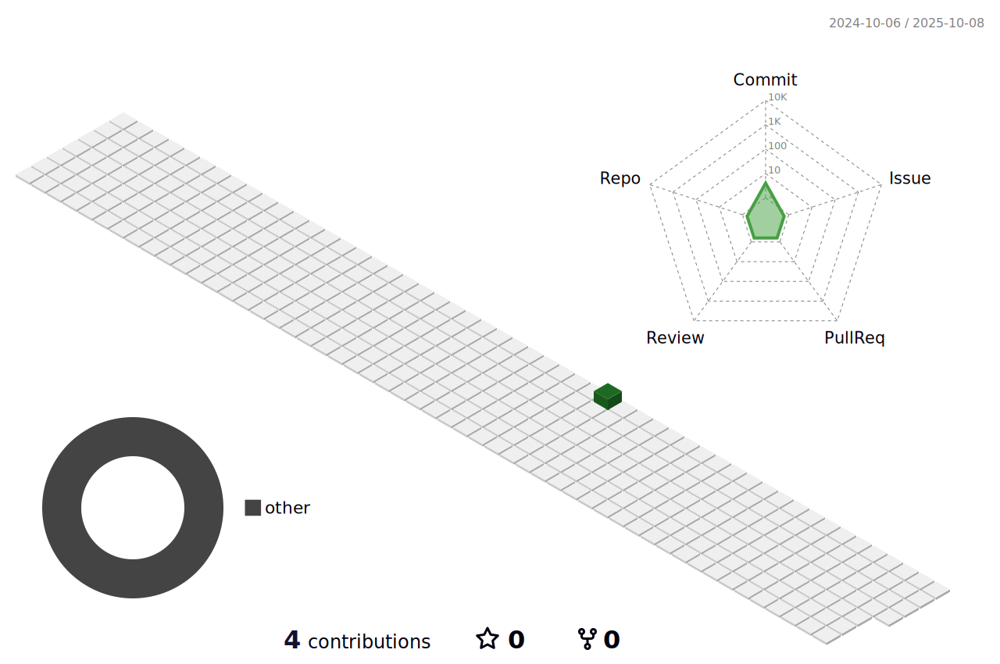

<h1 align="center">Olá 👋, Eu sou Felipe Mantoan Pardim</h1>

<!--  -->

<h3 align="center">Desenvolvedor Full-stack Angular/Node.js</h3>

  

- 🌱 Eu atualmente estou aprendendo **Angular e Node.js**

- 💬 Me pergunte sobre **Angular, Node.js, Javascript, Typescript e Ionic**

- 📫 Você pode me encontrar por **felmantoan@gmail.com**

<h3 align="left">Redes Sociais:</h3>

<h3 align="left">Linguagens e Tecnologias:</h3>

                    

